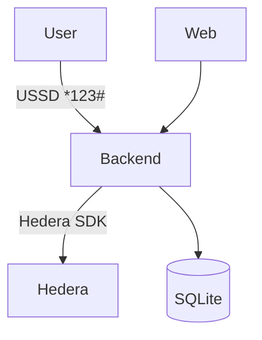

# 🌍 StarHash (HFlow) - USSD Hedera Wallet

**Send digital assets on any phone, no internet needed.**\
Built on Hedera Hashgraph for **3-second, sub-cent transactions**.

[](https://hedera.com)
[](LICENSE)

<div align="center">
  
</div>

## 🚀 Key Features

- **USSD Interface**: Dial `*384*2005#` to send HBAR (works on a kabambe).
- **Non-Custodial**: Users own keys (encrypted with PIN).
- **AI Fraud Detection**: Blocks scams in real-time.
- **Hedera-Powered**: 3-second TXs at $0.0001 fees.
- **Web API**: Ready for future apps.

## 📦 Quick Start

### Prerequisites

- Node.js 18+
- Hedera Testnet Account ([Get one](https://portal.hedera.com))
- SQL Cloud [connection url](sqlitecloud.io) (optional, will use local db by
  default)

### Installation

```bash
git clone https://github.com/Modexia-Tech/hflow.git
cd hflow/backend
npm install
cp .env.example .env  # Add your keys
```

### Run Locally

```bash
npm start
```

**Test USSD Flow**:\
Use Africas Talking [simulator](https://developers.africastalking.com/simulator)

-- or --

Simulate dialing `*384*2005#` with:

```bash
curl -X POST http://localhost:3000/ussd -d "phone=+254712345678&text=1*10*0.0.4567"
```

## 🌐 Architecture



## 📚 Documentation

- [API Reference](docs/API.md) - Endpoints for USSD/Web.
- [Hedera Integration](docs/HEDERA.md) - How TXs work.
- [Fraud Detection](docs/AI.md) - AI model details.

## 💡 Why Hedera?

| Metric       | Hedera  | Ethereum      | Solana        |
| ------------ | ------- | ------------- | ------------- |
| **Speed**    | 3s      | 5m+           | 5s            |
| **Fees**     | $0.0001 | $1+           | $0.01         |
| **Finality** | Instant | Probabilistic | Probabilistic |

## 🤝 Contribute

1. Fork the repo.
2. Add a feature (e.g., escrow smart contracts).
3. Submit a PR!

**First-time?** Try `good first issue` tags.

## 📜 License

MIT © 2025 StarHash Team\
_Not affiliated with Hedera or M-Pesa._

---
