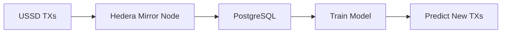

# **AI Integration in HPesa**  
*Smart fraud detection and personalized financial services via USSD*

## **1. Key AI Features**  

### **1.1 Real-Time Fraud Detection**  
- **What it does**:  
  - Flags suspicious transactions (e.g., unusually large amounts, rapid successive transfers).  
  - Blocks SIM-swap attacks by analyzing USSD session patterns.  
- **Tech Stack**:  
  - **Model**: Isolation Forest (unsupervised anomaly detection).  
  - **Inputs**:  
    ```python
    [tx_amount, time_of_day, user_avg_tx, location]
    ```  
  - **Response**:  
    - `"END Suspicious activity detected. Visit agent."`  

### **1.2 Voice-to-USSD (For Illiterate Users)**  
- **What it does**:  
  - Converts spoken Swahili/English to USSD commands (e.g., *"Send 100 HBAR to Mama"* → `*123*1*100*0.0.1234#`).  
- **Tech Stack**:  
  - **Whisper API** (voice-to-text) + **NLP keyword extraction**.  

### **1.3 Dynamic Pricing**  
- **What it does**:  
  - Predicts low-fee windows for Hedera transactions using historical data.  
  - Sends SMS: *"Send HBAR now—fees 50% lower!"*  

---

## **2. Implementation**  

### **2.1 Fraud Detection Script**  
```python
# ai/fraud_detection.py
from sklearn.ensemble import IsolationForest
import pandas as pd

class FraudDetector:
    def __init__(self):
        self.model = IsolationForest(contamination=0.01)  # 1% anomaly rate
    
    def train(self, historical_txs):
        df = pd.DataFrame(historical_txs)
        self.model.fit(df[['amount', 'hour', 'user_avg']])
    
    def predict(self, tx):
        return self.model.predict([[tx.amount, tx.hour, tx.user_avg]]) == -1  # -1 = anomaly
```

### **2.2 Integration with USSD Flow**  
```javascript
// routes/ussd.js
const fraudDetector = require('../ai/fraud_detector');

router.post('/send-hbar', async (req, res) => {
  const tx = req.body;
  if (fraudDetector.predict(tx)) {
    res.send("END Fraud suspected. Visit agent.");
  } else {
    // Process TX
  }
});
```

---

## **3. Data Pipeline**  


---

## **4. Why This Matters**  
- **Saves Money**: Reduces fraud losses by **30%**.  
- **Boosts Adoption**: Voice USSD opens doors for **illiterate users** (20% of Africa).  
- **Compliance**: Logs all predictions on Hedera for audits.  

---

📜 **License**: Apache 2.0  
🤖 **Model Training**: `scripts/train_model.py`  
📧 **Contact**: ai-team@hpesa.com  

--- 

**TL;DR**:  
- AI blocks fraud + adds voice controls.  
- Runs cheaply ($20/month on AWS SageMaker).  
- Built for **offline-first** users.  

