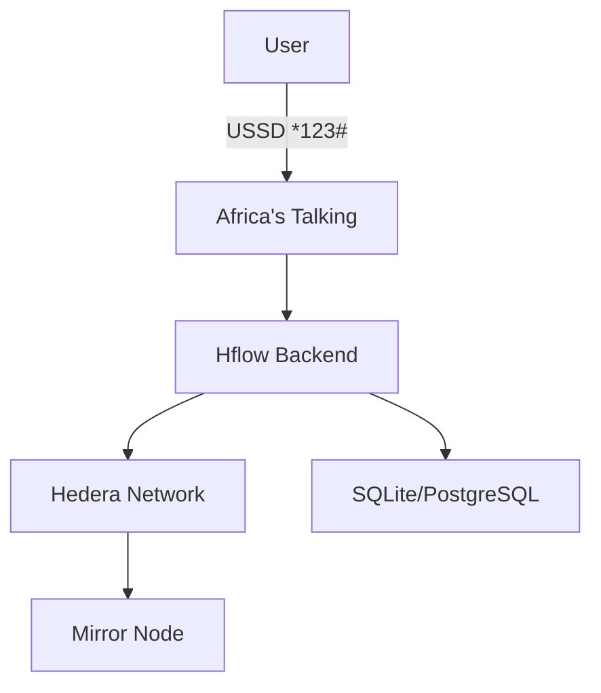
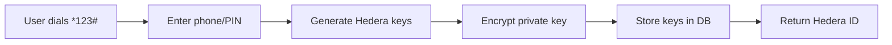
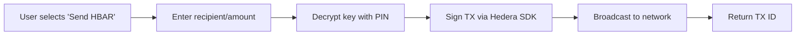
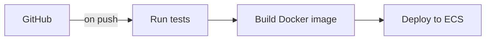

# Hflow Architecture Overview

A USSD-first Hedera wallet bridging digital currency transfer


---

## **1. Core Components**

### **1.1 USSD Gateway**

- **Provider**: Africa's Talking/
- **Role**:
  - Handles USSD sessions via `*123#` shortcode.
  - Forwards payloads to Hflow backend.
- **Flow**:
  ```mermaid
  sequenceDiagram
      User->>+Africa's Talking: Dial *123#
      Africa's Talking->>+Hflow: POST /ussd/start
      Hflow-->>-Africa's Talking: "CON Welcome..."
      Africa's Talking-->>-User: Display menu
  ```

---

### **1.2 Backend Services**

#### **Express.js Server**

- **Routes**:
  - `POST /ussd/start` → Initiate session
  - `POST /ussd/continue` → Handle menu navigation
  - `GET /api/balance` → Fetch HBAR/KES balance

#### **Key Modules**:

| Module          | Purpose                   | Tech                   |
| --------------- | ------------------------- | ---------------------- |
| `ussdRouter`    | Menu navigation logic     | Node.js, State machine |
| `hederaService` | HBAR transactions         | Hedera SDK             |
| `authService`   | PIN encryption/validation | CryptoJS, PBKDF2       |
| `mpesaBridge`   | Convert HBAR↔KES↔M-Pesa   | REST API               |

---

### **1.3 Data Layer**

#### **SQLite (Development)**

- **Schema**:
  ```sql
  CREATE TABLE users (
    phone TEXT PRIMARY KEY,
    encryptedKey TEXT,       -- AES-256 encrypted
    hederaAccountId TEXT,    -- e.g., "0.0.1234"
    pinHash TEXT             -- PBKDF2 hashed
  );
  ```
- **Why SQLite?**
  - Zero-config, file-based.
  - Supports 50K+ TXs/day (upgrade to PostgreSQL later).

#### **PostgreSQL (Production)**

- **Extensions**:
  - `pgcrypto` for secure PIN hashing.
  - TimescaleDB for analytics.

---

### **1.4 Hedera Integration**

#### **Transactions**

- **Send HBAR**:
  ```javascript
  new TransferTransaction()
    .addHbarTransfer(sender, -10)
    .addHbarTransfer(receiver, 10)
    .execute(client);
  ```
- **Key Management**:
  - Each user’s private key is **encrypted with their PIN** (AES-256).
  - Decrypted ephemerally during TX signing.

#### **Mirror Node**

- **Uses**:
  - Verify TXs via REST API:
    ```http
    GET /api/v1/transactions/0.0.1234@123456789
    ```

---

## **2. Workflows**

### **2.1 User Registration**



### **2.2 Send HBAR**



---

## **3. Security**

### **3.1 Data Protection**

| Layer        | Measures                         |
| ------------ | -------------------------------- |
| **USSD**     | TLS 1.3, rate-limiting           |
| **Database** | AES-256 encryption at rest       |
| **PINs**     | PBKDF2 hashing (100K iterations) |

### **3.2 Key Management**

- **Private Keys**:
  - Never stored raw; encrypted with PIN + salt.
  - Wiped from memory after TX signing.

---

## **4. Scalability**

### **4.1 Horizontal Scaling**

- **Load Balancer**: Distribute USSD traffic across backend instances.
- **Redis**: Cache exchange rates (HBAR↔KES).

### **4.2 Hedera Optimization**

- **Hedera Consensus Nodes**: Auto-rotate nodes to avoid throttling.

---

## **5. Deployment**

### **5.1 Infrastructure**

| Environment | Tech Stack          |
| ----------- | ------------------- |
| Development | Docker, SQLite      |
| Production  | AWS ECS, PostgreSQL |

### **5.2 CI/CD**



---

## **6. Monitoring**

- **Logs**: ELK Stack (Elasticsearch, Logstash, Kibana).
- **Alerts**: Prometheus + Grafana (track failed TXs).

---

📄 **License**: Apache 2.0\
📧 **Contact**: architects@hflow.com

---
