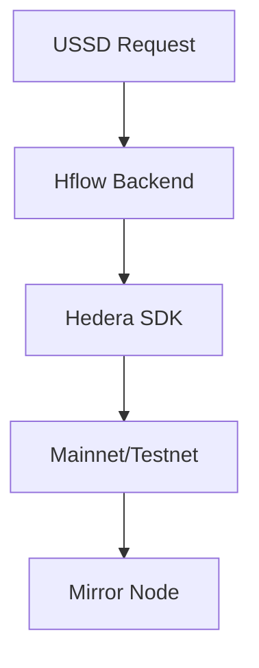

# **Hedera Integration Guide**

_How Hflow leverages Hedera Hashgraph for fast, low-cost transactions_



## **1. Why Hedera?**

| Feature             | Hedera                     | Alternatives (BTC/ETH)      |
| ------------------- | -------------------------- | --------------------------- |
| **Speed**           | 3-5 sec finality           | 10 mins (BTC), 15 sec (ETH) |
| **Fees**            | $0.0001 per TX             | $1+ (ETH), $0.50+ (BTC)     |
| **Carbon Negative** | ✅ Yes                     | ❌ No                       |
| **Regulatory**      | Enterprise-grade KYC tools | Pseudonymous                |

---

## **2. Key Components**

### **2.1 Accounts**

- Each user gets a **Hedera account** (`0.0.1234`).
- Private keys are:
  - Generated during USSD registration.
  - **AES-256 encrypted** with user’s PIN.
  - Stored in DB (never raw).

### **2.2 Transactions**

**Send HBAR Example**:

```javascript
const { TransferTransaction, Hbar } = require("@hashgraph/sdk");

async function sendHbar(senderId, senderKey, receiverId, amount) {
  const tx = await new TransferTransaction()
    .addHbarTransfer(senderId, new Hbar(-amount)) // Deduct sender
    .addHbarTransfer(receiverId, new Hbar(amount)) // Credit receiver
    .freezeWith(client) // Prepare
    .sign(PrivateKey.fromString(senderKey)); // Sign

  const txId = await tx.execute(client); // Broadcast
  return txId.toString(); // "0.0.1234@1713634567.123"
}
```

### **2.3 Smart Contracts (Coming Soon)**

- **Use Case**: Escrow for cash-outs.
- **Solidity-like Example**:
  ```solidity
  contract Escrow {
      function release(address recipient, uint amount) external {
          require(msg.sender == owner, "Unauthorized");
          payable(recipient).transfer(amount);
      }
  }
  ```

---

## **3. Setup Guide**

### **3.1 Install SDK**

```bash
npm install @hashgraph/sdk
```

### **3.2 Configure Client**

```javascript
// hedera-client.js
const { Client } = require("@hashgraph/sdk");
require("dotenv").config();

const client = Client.forTestnet(); // Or .forMainnet()
client.setOperator(
  process.env.HEDERA_OPERATOR_ID,
  process.env.HEDERA_OPERATOR_KEY,
);

module.exports = client;
```

### **3.3 Environment Variables**

```bash
# .env
HEDERA_OPERATOR_ID="0.0.XXXX"
HEDERA_OPERATOR_KEY="302e..."
HEDERA_NETWORK="testnet"  # or "mainnet"
```

---

## **4. Monitoring**

### **4.1 Mirror Node Queries**

```http
GET https://mainnet-public.mirrornode.hedera.com/api/v1/transactions/0.0.1234@1713634567.123
```

**Response**:

```json
{
  "transactions": [{
    "consensus_timestamp": "1234567890.000000000",
    "charged_tx_fee": 0.0001,
    "status": "SUCCESS"
  }]
}
```

### **4.2 Explorer Links**

- Testnet: [HashScan.io](https://hashscan.io/testnet)
- Mainnet: [HashScan.io](https://hashscan.io)

---

## **5. Best Practices**

1. **Key Management**:
   - Never log private keys.
   - 

2. **Error Handling**:
   ```javascript
   try {
     await tx.execute(client);
   } catch (err) {
     console.error("Hedera TX failed:", err.status);
   }
   ```

3. **Gas Optimization (Coming Soon)**:
   - Bundle TXs where possible (e.g., batch payments).

---

## **6. Troubleshooting**

| Issue                | Solution                      |
| -------------------- | ----------------------------- |
| `INSUFFICIENT_FEE`   | Increase fee to $0.0005       |
| `INVALID_ACCOUNT_ID` | Verify ID format (`0.0.1234`) |
| `BUSY`               | Retry with 1s delay           |
