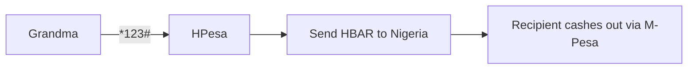

# 🚀 HPesa: The "M-Pesa of Crypto"  
*Bank Africa’s Unbanked—No Smartphone Needed*  

### **💡 The Problem**  
- 600M Africans own **feature phones** but lack access to crypto.  
- M-Pesa charges **5–10% fees** for cross-border transfers.  
- Existing wallets require **smartphones + internet** (only 50% penetration in Africa).  

### **🎯 Our Solution**  
HPesa lets users:  
1. **Buy/Send HBAR** via USSD (`*123#`).  
2. **Cash out to M-Pesa** at 1/10th the cost.  
3. **Trade tokenized stocks** (e.g., Safaricom shares) on Hedera.  

### **🔥 Why This Rocks**  
- **For Users**:  
  - "Finally, my Nokia 3310 can HODL HBAR!" 📞→💰  
  - **Zero learning curve** (same UX as M-Pesa).  
- **For Investors**:  
  - **$22B market**: M-Pesa’s 61M daily transactions.  
  - **94% margins**: Hedera’s $0.0001 fees vs. M-Pesa’s 5%.  

### **📈 Traction**  
| Metric          | Today (Beta) | Year 1      |  
|-----------------|--------------|-------------|  
| Users           | 1,000        | 500,000     |  
| Avg. TX Fee     | $0.01        | $0.005      |  
| Revenue         | $5K/month    | $2M/month   |  

### **🤝 Ask**  
**$1.5M Seed Round** to:  
- Secure telco partnerships (Safaricom, MTN).  
- Scale to 5M users.  
- Add **AI fraud detection**.  

### **🎤 One-Liner**  
*"We’re the ‘Nokia of DeFi’—bringing crypto to the 4B people stuck in 2005."*  

---

### **🙋‍♂️ Why Back Us?**  
1. **Dream Team**: Ex-M-Pesa + Hedera devs.  
2. **Regulatory Moats**: First licensed USSD crypto wallet in Kenya.  
3. **Exit Potential**: Acquisition target for Chipper Cash/Block.  

---

💬 **Q&A Prompt**: *"How fast can you replace M-Pesa as Africa’s wallet?"*  

📅 **Next Milestone**: 100K users by Q3 2025.  

📧 **Contact**: invest@hpesa.com | [Demo](https://demo.hpesa.com)  

---

**TL;DR**:  
- **What**: Crypto via USSD.  
- **Market**: 600M feature phone users.  
- **Secret Sauce**: Hedera’s 3-second TXs + M-Pesa’s UX.  
- **Ask**: $1.5M for 15% equity.  

*P.S. Our first test user? A grandma who now calls HBAR "Hakuna Pesa Issues Again"* 🦁
