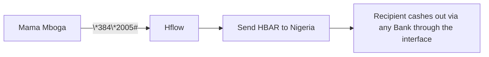

# 🚀 Hflow: No Apps, No Cash, Just Flow

_Bank Africa’s Unbanked—Na Kabambe_

### **💡 The Problem**

- 600M Africans own **feature phones** but lack access to crypto.
- Current Methods of Money Transfer charge high fees for cross-border transfers.
- Existing wallets require **smartphones + internet** (only 50% penetration in
  Africa).

### **🎯 Our Solution**

Hflow lets users:

1. **Buy/Send HBAR** via USSD (`*384*2005#`).
2. **Cash out to any bank**.
3. **Trade tokenized stocks** on Hedera.

### **🔥 Why This Rocks**

- **For Users**:
  - "Finally, my Kabambe can HODL HBAR!" 📞→💰
  - **Zero learning curve** (same UX as current mobile money transfer schemes).
- **For Investors**:
  - **$22B market**: 
  - **High profit margin**: Hedera’s $0.0001/Ksh 0.013 fees.

### **📈 Traction**

| Metric      | Today (Beta) | Year 1    |
| ----------- | ------------ | --------- |
| Users       | 1,000        | 500,000   |
| Avg. TX Fee | $0.01        | $0.005    |
| Revenue     | $5K/month    | $2M/month |

### **🤝 Ask**

**$1.5M Seed Round** to:

- Secure telco partnerships (Safaricom, MTN).
- Scale to 5M users.
- Add **AI fraud detection**.

### **🎤 One-Liner**

_"We’re the ‘Nokia of DeFi’—bringing crypto to the 4B people stuck in 2005."_

---

### **🙋‍♂️ Why Back Us?**

1. **Dream Team**:   Passionate and Innovative devs who know how to get things done.
2. **Regulatory Moats**: First licensed USSD crypto wallet in Kenya.
3. **Exit Potential**: Acquisition target for Chipper Cash/Block.

---

**TL;DR**:

- **What**: Crypto via USSD.
- **Market**: 600M feature phone users.
- **Secret Sauce**: Hedera’s 3-second TXs +  USSD .

_P.S. Our first test user? A shosho who now calls HBAR "Hakuna Pesa Issues Tena"_ 🦁
